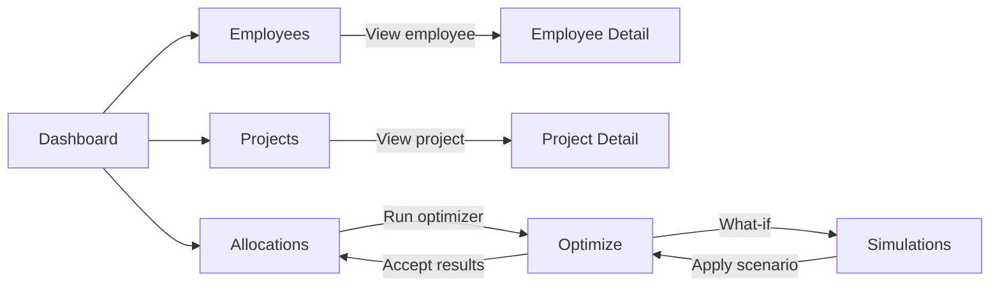
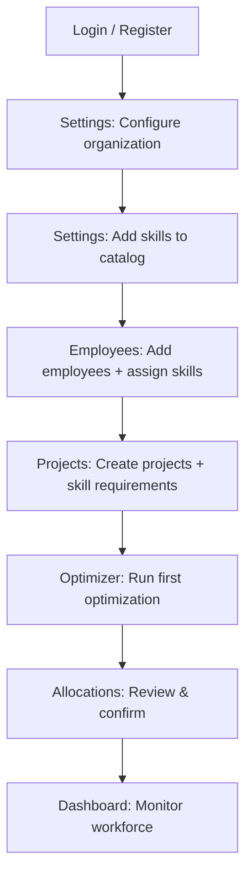
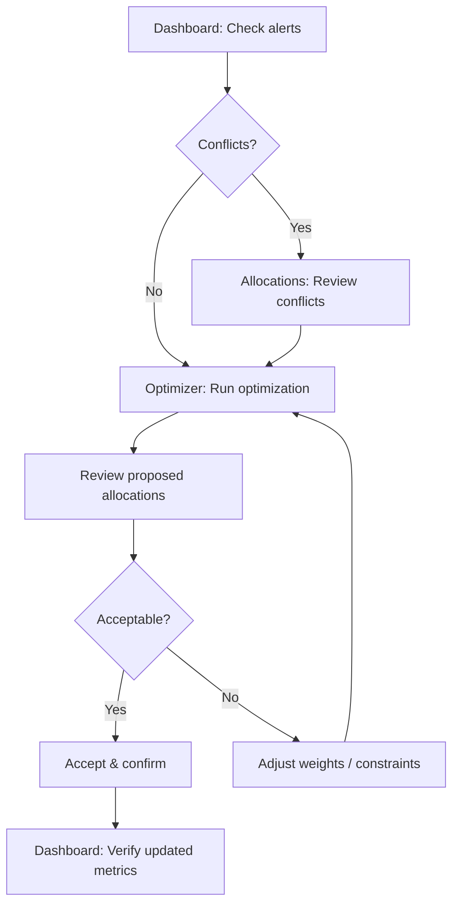
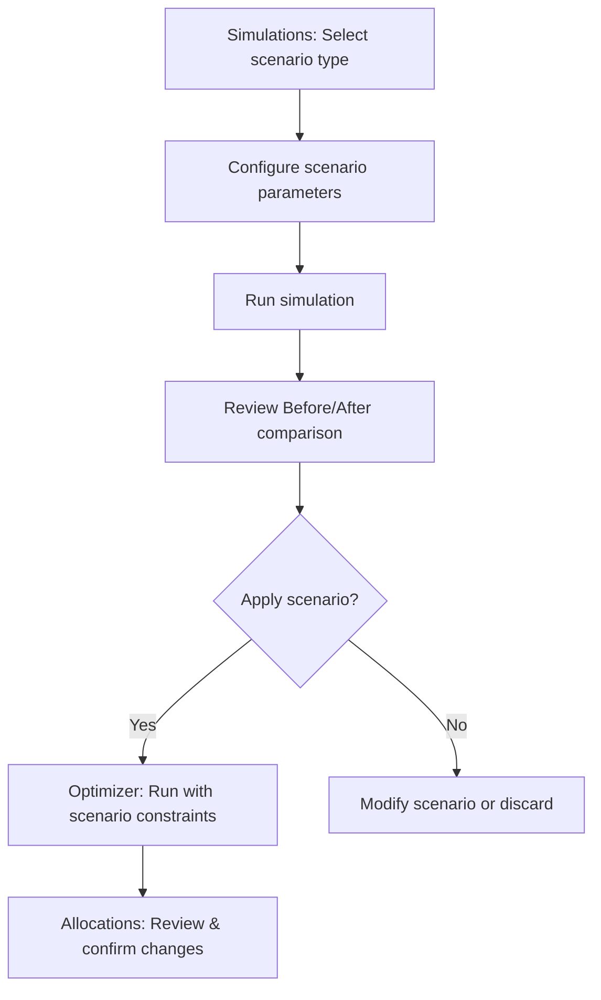
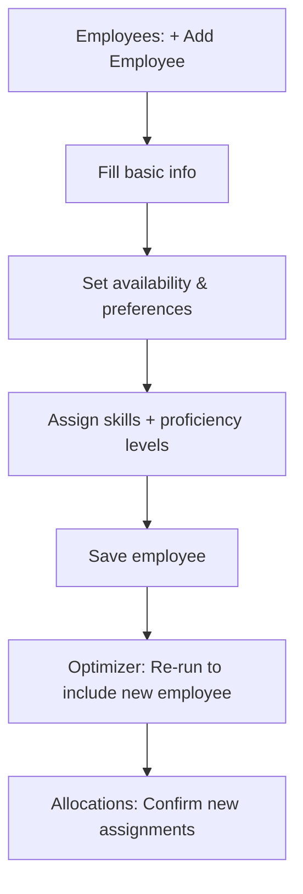
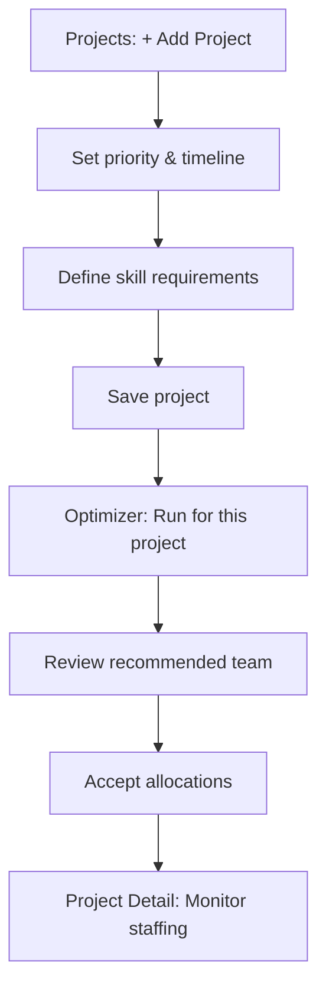

# Workforce Allocation Optimizer — Page Features & UI Flow

> This document details every page, its layout, components, interactions, and navigation flow needed to complete the application frontend. It is the companion spec to [`implementation_plan.md`](file:///c:/Users/Peter.LAPTOP-GJB0UETS/workforce-optimizer/implementation_plan.md).

---

## Global Layout & Navigation

### App Shell

| Element | Description |
|---|---|
| **Sidebar** | Fixed left sidebar (collapsed on mobile → hamburger). Contains nav links with icons and active-state highlight. |
| **Top Bar** | Sticky header: page title (dynamic), global search input, notification bell icon, user avatar + dropdown. |
| **Content Area** | Scrollable main content area with consistent padding and max-width container. |
| **Toast System** | Bottom-right toast stack for success/error/info messages with auto-dismiss (5 s). |

### Navigation Items (Sidebar)

| Icon | Label | Route | Phase |
|---|---|---|---|
| 📊 | Dashboard | `/dashboard` | Phase 3 |
| 👥 | Employees | `/employees` | Phase 1 |
| 📁 | Projects | `/projects` | Phase 1 |
| 🔗 | Allocations | `/allocations` | Phase 1 |
| 🚀 | Optimizer | `/optimize` | Phase 2 |
| 🔬 | Simulations | `/simulations` | Phase 4 |
| ⚙️ | Settings | `/settings` | Phase 1 |

### Navigation Flow



---

## Page 1 — Dashboard (`/dashboard`)

> **Phase 3** · The landing page after login. Provides a bird's-eye view of workforce health.

### Layout (3 rows)

```
┌──────────────────────────────────────────────────────┐
│  Row 1: Overview Metric Cards (4-column grid)        │
├──────────────────────────────────────────────────────┤
│  Row 2: Left — Utilization Chart │ Right — Skill Gap │
├──────────────────────────────────────────────────────┤
│  Row 3: Project Allocation Table (full width)        │
│         + Workforce Heatmap (full width)             │
└──────────────────────────────────────────────────────┘
```

### Features

#### F1.1 — Overview Metric Cards
- **Total Employees**: Count with trend indicator (↑/↓ vs. last month).
- **Active Projects**: Count with status breakdown tooltip (e.g., 12 active, 3 completed).
- **Avg Utilization %**: Gauge-style percentage with color coding (green < 80%, yellow 80–95%, red > 95%).
- **Alerts**: Count of overallocated employees + understaffed projects, clickable to filter views.

#### F1.2 — Utilization Bar Chart
- Horizontal bar chart, one bar per employee.
- Color coding: green (0–70%), yellow (71–90%), red (91–100%), dark red (> 100% = overallocated).
- Hover tooltip: employee name, current hours, max hours, project list.
- Click bar → navigate to Employee Detail page.
- Sort controls: by name, by utilization %, by department.

#### F1.3 — Skill Gap Analysis Panel
- Grouped bar chart or bubble chart: **Skills in demand** (required by projects) vs. **Skills available** (supplied by employees).
- Gap indicator badge per skill: `+3 surplus` (green) or `-2 deficit` (red).
- Clicking a skill → filters Employees page to show employees with that skill.

#### F1.4 — Project Allocation Table
- Columns: Project Name, Priority Badge, Deadline, Staffing Progress (progress bar), Skill Coverage %, Status (🟢 Fully Staffed / 🟡 Partial / 🔴 Unstaffed).
- Sortable by any column.
- Click row → navigate to Project Detail page.
- Inline quick-action: "🚀 Optimize" button per project.

#### F1.5 — Workforce Heatmap
- Grid: rows = employees, columns = days of the week (Mon–Fri).
- Cell color intensity = hours allocated that day (light → dark gradient).
- Hover tooltip: employee name, hours per project on that day.
- Legend bar showing hour-to-color mapping.

---

## Page 2 — Employees List (`/employees`)

> **Phase 1** · View, search, filter, and manage all employees.

### Layout

```
┌──────────────────────────────────────────────────────┐
│  Top Bar: Search | Filter Dropdowns | + Add Employee │
├──────────────────────────────────────────────────────┤
│  Employee Table / Card Grid (toggle view)            │
├──────────────────────────────────────────────────────┤
│  Pagination                                          │
└──────────────────────────────────────────────────────┘
```

### Features

#### F2.1 — Search & Filters
- **Search**: Debounced text search across name, email, department.
- **Filter by**: Department (dropdown), Skills (multi-select), Availability (date range), Utilization Range (slider 0–120%).
- **View Toggle**: Table view (default) / Card grid view.
- Active filters shown as removable chips below the search bar.

#### F2.2 — Employee Table View
- Columns: Avatar + Name, Department, Role, Skills (SkillBadge components, max 3 visible + "+N more" overflow), Utilization (UtilizationBar), Max Hours, Actions (Edit / Delete).
- Sortable columns: Name, Department, Utilization.
- Row click → Employee Detail page.
- Bulk select via checkboxes → bulk assign to project, bulk delete.

#### F2.3 — Employee Card View
- Card layout: avatar, name, department, role tag.
- Skill badges row (color-coded by proficiency).
- Circular utilization gauge.
- Hover: expand to show current project allocations.

#### F2.4 — Add / Edit Employee Modal
- **Sections** (tabbed or accordion):
  1. **Basic Info**: Name, Email, Role (dropdown), Department (dropdown with create-new option).
  2. **Availability**: Max weekly hours (number input with slider), Work preference (Remote / Onsite / Hybrid radio), Availability window (start & end date pickers).
  3. **Skills**: Searchable skill picker (autocomplete from existing skills or create new), Per-skill: proficiency level (Beginner / Intermediate / Advanced / Expert dropdown), years of experience (number input). Skill rows are dynamically addable/removable.
  4. **Preferences**: Preferred technologies (tag input, JSON), Preferred project type (dropdown), Max weekly hours override.
- **Validation**: Email format, required fields (name, email), duplicate email check (async), max hours must be > 0.
- **Save**: POST/PUT to API → toast success → refresh list.

#### F2.5 — Delete Confirmation
- Confirmation dialog with warning: "This employee has N active allocations. Deleting will remove all assignments."
- Option to reassign allocations before deleting.

---

## Page 3 — Employee Detail (`/employees/:id`)

> **Phase 1** · Deep view into a single employee's profile, skills, and allocations.

### Layout

```
┌──────────────────────────────────────────────────────┐
│  Header: Avatar, Name, Role, Department, Edit btn    │
├─────────────────────────┬────────────────────────────┤
│  Left: Info + Skills    │  Right: Utilization Gauge  │
├─────────────────────────┴────────────────────────────┤
│  Current Allocations Table                           │
├──────────────────────────────────────────────────────┤
│  Allocation History Timeline                         │
└──────────────────────────────────────────────────────┘
```

### Features

#### F3.1 — Profile Header
- Large avatar (initials-based or uploaded), name, role badge, department tag.
- Edit button → opens Edit Employee modal (same as F2.4, pre-filled).
- Status indicator: Available / Partially Allocated / Fully Allocated / Overallocated.

#### F3.2 — Skills Panel
- List of skills with: SkillBadge, proficiency level bar (visual 1–4 scale), years of experience.
- "Add Skill" inline button.

#### F3.3 — Utilization Gauge
- Circular/donut chart: used hours vs. remaining capacity.
- Center text: "32 / 40 hrs" and "80%".
- Color changes at thresholds (green → yellow → red).

#### F3.4 — Current Allocations Table
- Columns: Project Name (linked), Allocated Hours, Date Range, Status Badge (Proposed / Confirmed / Completed), Allocation Score, Assignment Reason (truncated, expandable).
- Inline actions: Edit hours, Change status, Remove allocation.

#### F3.5 — Allocation History
- Timeline/activity log showing past allocations.
- Each entry: project name, hours, date range, final status.

---

## Page 4 — Projects List (`/projects`)

> **Phase 1** · Manage all projects, their requirements, and staffing status.

### Layout

```
┌──────────────────────────────────────────────────────┐
│  Top Bar: Search | Status Filter | + Add Project     │
├──────────────────────────────────────────────────────┤
│  Project Cards Grid (responsive 1–3 columns)         │
├──────────────────────────────────────────────────────┤
│  Pagination                                          │
└──────────────────────────────────────────────────────┘
```

### Features

#### F4.1 — Search & Filters
- **Search**: Project name, description.
- **Filter by**: Status (Active / Completed / On Hold), Priority (Low / Medium / High / Critical), Staffing Status (Fully Staffed / Partial / Unstaffed), Deadline range.

#### F4.2 — Project Cards
- Card content:
  - Project name (bold, linked to detail).
  - Priority badge: colored pill (Low = gray, Medium = blue, High = orange, Critical = red).
  - Status badge.
  - Deadline with countdown (e.g., "12 days remaining" or "⚠️ 2 days overdue").
  - Staffing progress bar: N / M required hours filled (percentage).
  - Skill tags: required skills shown as small badges.
  - Quick stats row: estimated hours, assigned team size.
- Hover: subtle elevation + border glow.
- Click card → Project Detail page.

#### F4.3 — Add / Edit Project Modal
- **Sections**:
  1. **Basic Info**: Name, Description (textarea with markdown support preview), Status (dropdown), Priority (dropdown).
  2. **Timeline**: Start date (date picker), Deadline (date picker), Estimated total hours (number input).
  3. **Skill Requirements Builder**: 
     - Dynamic list of required skills.
     - Per skill row: Skill (searchable dropdown), Required Proficiency (dropdown: Beginner–Expert), Required Hours (number input).
     - Add/remove skill requirement rows.
     - Visual summary: total required hours across all skills.
- **Validation**: Name required, deadline must be after start date, at least one skill requirement recommended (warning, not blocking).

---

## Page 5 — Project Detail (`/projects/:id`)

> **Phase 1** · Full view of a single project: requirements, team, and progress.

### Layout

```
┌──────────────────────────────────────────────────────┐
│  Header: Name, Priority Badge, Status, Edit btn      │
├─────────────────────────┬────────────────────────────┤
│  Left: Requirements     │  Right: Staffing Gauge     │
├─────────────────────────┴────────────────────────────┤
│  Team Allocation Table                               │
├──────────────────────────────────────────────────────┤
│  Skill Coverage Matrix                               │
└──────────────────────────────────────────────────────┘
```

### Features

#### F5.1 — Project Header
- Name, description (collapsible), priority badge, status badge, deadline countdown.
- Edit button → opens Edit Project modal (pre-filled).
- "🚀 Optimize This Project" action button.

#### F5.2 — Skill Requirements Panel
- Table: Skill Name, Required Proficiency, Required Hours, Filled Hours, Coverage % (progress bar).
- Color-coded: green (100% filled), yellow (50–99%), red (< 50%).

#### F5.3 — Staffing Gauge
- Donut chart: filled hours vs. total estimated hours.
- Team size count.
- "Understaffed by N hours" warning if applicable.

#### F5.4 — Team Allocation Table
- Columns: Employee Name (linked), Skills (badges), Allocated Hours, Skill Match %, Allocation Score, Assignment Reason, Status.
- Actions: Adjust hours, Remove from project.
- "+ Assign Employee" button → opens assignment form (searchable employee picker filtered by relevant skills).

#### F5.5 — Skill Coverage Matrix
- Heatmap grid: rows = required skills, columns = assigned employees.
- Cell color = proficiency match quality (dark green = exceeds, light green = meets, yellow = below, gray = no match).
- Shows at a glance which skills are covered and by whom.

---

## Page 6 — Allocations (`/allocations`)

> **Phase 1** · View and manage all employee-project assignments in one place.

### Layout

```
┌──────────────────────────────────────────────────────┐
│  Top Bar: Filters | View Toggle | + Manual Assign    │
├──────────────────────────────────────────────────────┤
│  View A: Allocation Table (default)                  │
│  View B: Kanban Board (by status)                    │
│  View C: Timeline / Gantt View                       │
├──────────────────────────────────────────────────────┤
│  Conflict Warnings Panel (collapsible)               │
└──────────────────────────────────────────────────────┘
```

### Features

#### F6.1 — Allocation Table View
- Columns: Employee, Project, Allocated Hours, Date Range, Status (Proposed / Confirmed / Completed), Score, Reason (expandable).
- Filters: by employee, by project, by status, by date range.
- Inline edit: click cell to adjust hours or status.
- Multi-select → bulk confirm or bulk delete.

#### F6.2 — Kanban Board View
- Three columns: **Proposed** → **Confirmed** → **Completed**.
- Cards show: employee avatar + name, project name, hours, score.
- Drag-and-drop cards between columns to change status.

#### F6.3 — Timeline / Gantt View
- Horizontal timeline: rows = employees, bars = project allocations.
- Bar color = project priority.
- Bar width = duration (start to end date).
- Overlapping bars visually highlight overallocation conflicts.
- Zoom controls: week / month / quarter view.

#### F6.4 — Manual Assignment Form
- Step 1: Select Employee (searchable dropdown with utilization preview).
- Step 2: Select Project (searchable dropdown with staffing status preview).
- Step 3: Set hours, date range, status.
- Conflict check: real-time warning if assignment would overallocate the employee.
- Save → POST to API → toast success → refresh.

#### F6.5 — Conflict Warnings Panel
- Collapsible bottom panel listing all current conflicts:
  - Overallocated employees (> max hours).
  - Skills mismatch (employee assigned to project requiring skills they don't have).
  - Deadline at risk (project understaffed with deadline approaching).
- Each warning is actionable: click → navigates to relevant employee/project.

---

## Page 7 — Optimizer (`/optimize`)

> **Phase 2** · Run the optimization engine and review proposed allocations.

### Layout

```
┌──────────────────────────────────────────────────────┐
│  Configuration Panel                                 │
├──────────────────────────────────────────────────────┤
│  🚀 Run Optimization Button + Progress Indicator     │
├──────────────────────────────────────────────────────┤
│  Results: Summary Metrics Row                        │
├──────────────────────────────────────────────────────┤
│  Results: Per-Project Recommendation Cards           │
├──────────────────────────────────────────────────────┤
│  Actions: Accept All | Accept Selected | Reject All  │
└──────────────────────────────────────────────────────┘
```

### Features

#### F7.1 — Configuration Panel
- **Scope**: All projects (default), or select specific projects (multi-select).
- **Weight Sliders** (optional advanced toggle):
  - Skill Match weight (default 50%)
  - Availability weight (default 20%)
  - Workload Balance weight (default 15%)
  - Experience weight (default 10%)
  - Preference weight (default 5%)
  - Sliders must always sum to 100% (auto-balance).
- **Constraints Toggle**: Respect max hours (on/off), Allow overallocation (on/off with warning).

#### F7.2 — Run Optimization
- Large "🚀 Optimize Allocation" CTA button.
- On click: loading state with animated progress indicator and status text ("Scoring employees…", "Running allocator…", "Generating explanations…").
- Disable button during execution.

#### F7.3 — Summary Metrics Row
- Card row showing optimization results:
  - **Overall Score**: weighted average across all proposed allocations.
  - **Skill Coverage**: % of project skill requirements met.
  - **Workload Balance**: standard deviation of employee utilization (lower = better).
  - **Employees Allocated**: N of M total.
  - **Projects Covered**: N of M total.
- Each metric shows a comparison to the current state (delta arrow: ↑ improved / ↓ worsened).

#### F7.4 — Per-Project Recommendation Cards
- One expandable card per project:
  - Project name, priority badge, deadline.
  - List of recommended employees, each showing:
    - Employee name + avatar.
    - Allocated hours.
    - Skill match % (circular progress).
    - Allocation score.
    - **AllocationReasonCard** (expandable):
      - Skill match breakdown (per skill: required vs. actual proficiency, ✓/✗).
      - Available hours remaining.
      - Current utilization %.
      - Project priority factor.
  - Per-employee actions: ✅ Accept / ❌ Reject / ✏️ Modify hours.

#### F7.5 — Bulk Actions
- "✅ Accept All Proposed" → confirms all → creates allocation records → navigates to Allocations page.
- "Accept Selected" → only checked recommendations.
- "❌ Reject All" → discards results.
- Confirmation dialog before accept/reject.

---

## Page 8 — Simulations (`/simulations`)

> **Phase 4** · What-if scenario planning and impact analysis.

### Layout

```
┌──────────────────────────────────────────────────────┐
│  Scenario Builder Form                               │
├──────────────────────────────────────────────────────┤
│  Run Simulation Button                               │
├─────────────────────────┬────────────────────────────┤
│  Before State           │  After State               │
├─────────────────────────┴────────────────────────────┤
│  Impact Summary + Recommended Changes                │
└──────────────────────────────────────────────────────┘
```

### Features

#### F8.1 — Scenario Builder
- **Scenario Types** (tab or radio selection):
  1. **Remove Employee**: Select employee → "What happens if [Employee] becomes unavailable?"
  2. **Change Deadline**: Select project → new deadline date picker → "What if deadline moves to [date]?"
  3. **Add New Project**: Mini project form (name, priority, skill requirements, hours) → "What if we add this project?"
  4. **Change Capacity**: Select employee → new max hours → "What if [Employee] reduces to [N] hours/week?"
- Scenario description auto-generated from selections.

#### F8.2 — Before / After Comparison
- Side-by-side panels:
  - **Before**: Current allocation state (table of allocations, utilization chart snapshot).
  - **After**: Simulated allocation state (same structure, with changes highlighted).
- Diff highlighting: added allocations (green), removed allocations (red), modified (yellow).

#### F8.3 — Impact Summary
- Metrics delta cards:
  - Employees affected: N.
  - Projects affected: N.
  - Utilization change: avg ↑/↓ by X%.
  - New conflicts introduced: N.
  - Skill coverage change: X% → Y%.
- Severity badge: 🟢 Low Impact / 🟡 Moderate / 🔴 High Impact.

#### F8.4 — Recommended Reassignments
- Table: Employee, From Project, To Project, Hours, Reason.
- "Apply This Scenario" button → runs optimizer with scenario constraints → navigates to Optimize page with pre-filled results.

---

## Page 9 — Settings (`/settings`)

> **Phase 1** · Application configuration and profile management.

### Features

#### F9.1 — Profile Settings
- Name, email, password change form.
- Avatar upload.

#### F9.2 — Organization Settings
- Company name, default work hours per week.
- Department management (CRUD list).

#### F9.3 — Skill Catalog Management
- Full CRUD for the skills table.
- Table: Skill Name, Category, # Employees, # Projects, Actions (Edit / Delete).
- Bulk import (CSV upload).

#### F9.4 — Optimization Defaults
- Default weight sliders (persisted to DB or config).
- Default constraint settings.

---

## Shared UI Components

These reusable components appear across multiple pages.

### `SkillBadge`
- Pill-shaped badge with skill name.
- Background color derived from proficiency: Beginner (gray), Intermediate (blue), Advanced (purple), Expert (gold).
- Optional: small icon indicating proficiency level.
- Hover tooltip: "React — Advanced (4 years)".

### `UtilizationBar`
- Horizontal progress bar.
- Fill color: green (0–70%), yellow (71–90%), red (91–100%), pulsing red (> 100%).
- Label: "32 / 40 hrs (80%)".

### `PriorityBadge`
- Pill badge: Low (gray), Medium (blue), High (orange), Critical (pulsing red).

### `StatusBadge`
- Pill badge: Proposed (dotted border, blue), Confirmed (solid green), Completed (solid gray).

### `OverviewCard`
- Metric card: icon, title, value (large number), trend indicator (↑↓ with color), subtitle.
- Subtle gradient background.

### `AllocationReasonCard`
- Expandable card showing why an employee was assigned.
- Sections: Skill Match Breakdown, Availability, Workload, Experience, Preference.
- Each factor shows score + explanation text.

### `HeatmapGrid`
- Configurable grid with customizable row/column labels.
- Cell color intensity mapped to data value.
- Hover tooltip with raw value.

### `ProjectStatusTable`
- Sortable table with inline progress bars and status badges.
- Row click navigation.

### `SearchableDropdown`
- Autocomplete dropdown with search input.
- Supports single-select and multi-select modes.
- "Create new" option at bottom when no match found.

### `ConfirmationDialog`
- Modal with title, description, warning message, and Confirm/Cancel buttons.
- Destructive actions use red Confirm button.

### `EmptyState`
- Illustrated placeholder shown when a list/table has no data.
- Contextual message + CTA button (e.g., "No employees yet. Add your first employee →").

### `DateRangePicker`
- Dual calendar input for selecting start and end dates.
- Preset ranges: This Week, This Month, This Quarter.

### `FilterChips`
- Row of removable chips showing active filters.
- "Clear All" button at the end.

---

## User Flows

### Flow 1 — First-Time Setup


### Flow 2 — Daily Optimization Cycle


### Flow 3 — What-If Planning


### Flow 4 — Employee Onboarding


### Flow 5 — New Project Kickoff


---

## Responsive Breakpoints

| Breakpoint | Width | Layout Changes |
|---|---|---|
| **Desktop** | ≥ 1280 px | Full sidebar, multi-column grids, side-by-side panels |
| **Tablet** | 768–1279 px | Collapsed sidebar (icon-only, expand on hover), 2-column grids, stacked panels |
| **Mobile** | < 768 px | Hidden sidebar (hamburger menu), single-column layout, bottom-sheet modals, simplified charts |

---

## Accessibility Requirements

- All interactive elements keyboard-navigable (Tab, Enter, Escape).
- ARIA labels on icons, charts, and dynamic content.
- Color contrast ratio ≥ 4.5:1 for text, ≥ 3:1 for large text.
- Screen reader announcements for toast notifications and dynamic content changes.
- Focus trap in modals.
- Reduced motion media query support for animations.

---

## State Management Considerations

| State Type | Approach |
|---|---|
| **Server State** | React Query / SWR for API data fetching, caching, and invalidation |
| **UI State** | React Context or Zustand for sidebar toggle, active filters, view mode toggles |
| **Form State** | React Hook Form for all modals/forms with validation |
| **Optimistic Updates** | Status changes (Proposed → Confirmed) update UI immediately, rollback on error |
