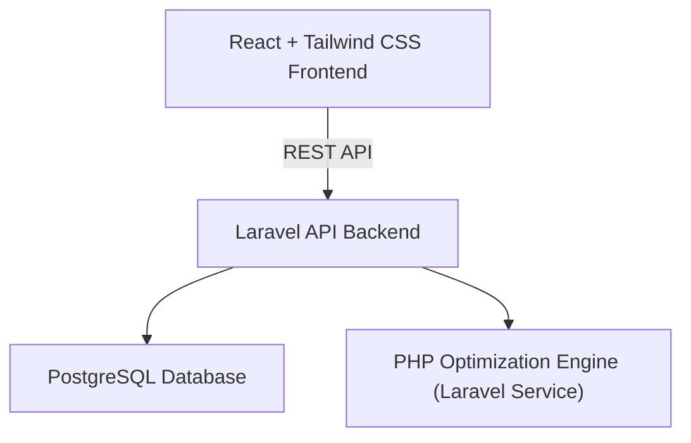
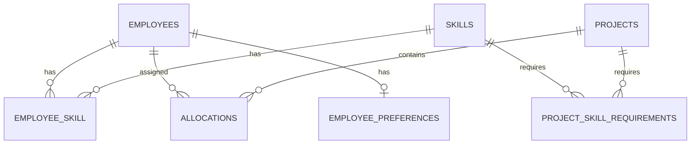

# Workforce Allocation Optimizer — Implementation Plan

A full-stack optimization system that answers: *"Given our employees, their skills, availability, current workload, and project requirements — who should work on which project?"*

## Proposed Architecture



| Layer | Technology | Responsibility |
|---|---|---|
| Frontend | React, Tailwind CSS | Dashboard, forms, visualizations |
| Backend API | Laravel (PHP) | Authentication, CRUD, business logic |
| Database | PostgreSQL | Persistent storage |
| Optimizer | PHP (Laravel Services) | Allocation scoring & constraint solving |

---

## User Review Required

> [!IMPORTANT]
> **Tech stack confirmation** — The stack is Laravel + React + PostgreSQL with a PHP-native optimizer. Please confirm this is the stack you want, or if you'd prefer alternatives (e.g., Next.js instead of plain React, MySQL instead of PostgreSQL).

> [!IMPORTANT]
> **Optimization approach** — The plan starts with weighted scoring (Phase 2) and upgrades to Integer Linear Programming via OR-Tools (Phase 4). Should we target ILP from the start, or is the phased approach acceptable?

> [!NOTE]
> **PHP-native optimizer** — The optimizer is implemented entirely in PHP as Laravel services. This keeps the entire backend in one stack and simplifies deployment (no separate Python process needed).

## Open Questions

1. **Authentication scope** — Should we implement multi-tenant auth (multiple companies), or single-organization with role-based access (Admin / Manager / Viewer)?
2. **Deployment target** — Where will this be hosted? (Docker, shared hosting, cloud VM, etc.) This affects architectural decisions.
3. **Seed data** — Should we include a seeder with realistic demo data (100+ employees, 20+ projects) for portfolio demonstrations?
4. **Notification system** — Should the app notify managers of conflicts/overallocations, or is the dashboard sufficient?

---

## Phase 1 — Core (CRUD Foundation)

The foundation: manage employees, skills, projects, and manual allocation.

---

### Database Design

#### [NEW] `database/migrations/` — All migration files

**Tables to create:**

```
employees
├── id, name, email, role, department
├── max_weekly_hours (default: 40)
├── remote_preference (enum: remote / onsite / hybrid)
├── availability_start, availability_end
└── timestamps

skills
├── id, name, category
└── timestamps

employee_skill (pivot)
├── employee_id, skill_id
├── proficiency_level (enum: beginner / intermediate / advanced / expert)
└── years_of_experience

projects
├── id, name, description, status
├── priority (enum: low / medium / high / critical)
├── deadline, start_date
├── estimated_hours
└── timestamps

project_skill_requirements (pivot)
├── project_id, skill_id
├── required_proficiency (enum: beginner / intermediate / advanced / expert)
└── required_hours

allocations
├── id, employee_id, project_id
├── allocated_hours, start_date, end_date
├── status (enum: proposed / confirmed / completed)
├── assignment_reason (text — explainability)
├── allocation_score (float)
└── timestamps

employee_preferences
├── employee_id
├── preferred_technologies (JSON)
├── preferred_project_type (enum)
└── max_weekly_hours_override
```



---

### Laravel Backend — Models & API

#### [NEW] `app/Models/Employee.php`
- Relationships: `skills()`, `allocations()`, `projects()`, `preferences()`
- Computed attributes: `current_workload`, `remaining_capacity`, `utilization_percentage`

#### [NEW] `app/Models/Skill.php`
- Relationships: `employees()`, `projectRequirements()`

#### [NEW] `app/Models/Project.php`
- Relationships: `skillRequirements()`, `allocations()`, `employees()`
- Computed: `staffing_coverage`, `skill_coverage`

#### [NEW] `app/Models/Allocation.php`
- Relationships: `employee()`, `project()`

#### [NEW] `app/Models/EmployeePreference.php`

---

### API Routes

#### [NEW] `routes/api.php`

| Method | Endpoint | Description |
|---|---|---|
| `GET/POST` | `/api/employees` | List / create employees |
| `GET/PUT/DELETE` | `/api/employees/{id}` | View / update / delete employee |
| `POST` | `/api/employees/{id}/skills` | Attach skills to employee |
| `GET/POST` | `/api/skills` | List / create skills |
| `GET/POST` | `/api/projects` | List / create projects |
| `GET/PUT/DELETE` | `/api/projects/{id}` | View / update / delete project |
| `POST` | `/api/projects/{id}/requirements` | Set skill requirements |
| `GET/POST` | `/api/allocations` | List / create allocations |
| `PUT/DELETE` | `/api/allocations/{id}` | Update / remove allocation |
| `GET` | `/api/dashboard/overview` | Workforce overview stats |

---

### React Frontend — Core Pages

#### [NEW] `src/pages/EmployeesPage.jsx`
- Table listing all employees with skill badges
- Add/Edit employee modal with skill picker + proficiency level
- Utilization bar per employee

#### [NEW] `src/pages/ProjectsPage.jsx`
- Project cards with priority badge, deadline, staffing progress
- Add/Edit project form with skill requirements builder

#### [NEW] `src/pages/AllocationsPage.jsx`
- Manual drag-and-drop or form-based assignment
- Show assignment reason and score
- Conflict warnings (overallocation)

#### [NEW] `src/components/SkillBadge.jsx`
- Visual skill tag with proficiency level color coding

#### [NEW] `src/components/UtilizationBar.jsx`
- Horizontal bar chart showing employee utilization percentage

---

## Phase 2 — Optimizer Engine

The brain: skill matching, availability-aware allocation, workload balancing.

---

### Scoring Formula

```
Allocation Score =
    Skill Match     × 50%
  + Availability    × 20%
  + Workload Balance × 15%
  + Experience      × 10%
  + Preference      × 5%
```

---

### PHP Optimization Service (Laravel)

#### [NEW] `app/Services/Optimizer/ScoringService.php`
- `calculateSkillMatch(Employee $employee, Project $project)` → 0–100
- `calculateAvailability(Employee $employee)` → 0–100
- `calculateWorkloadBalance(Employee $employee, Collection $allEmployees)` → 0–100
- `calculateExperienceScore(Employee $employee, Project $project)` → 0–100
- `calculatePreferenceScore(Employee $employee, Project $project)` → 0–100
- `compositeScore(...)` → weighted final score

#### [NEW] `app/Services/Optimizer/AllocatorService.php`
- Greedy allocation: iterate projects by priority, assign top-scoring available employees
- Respect constraints: don't exceed remaining capacity, meet minimum proficiency
- Returns: ranked allocation recommendations with scores and explanations

---

### Laravel Integration

#### [NEW] `app/Services/Optimizer/OptimizerService.php`
- Orchestrates the optimization pipeline: collects data, calls ScoringService + AllocatorService
- Returns proposed allocations with scores and human-readable explanations

#### [NEW] API Endpoints

| Method | Endpoint | Description |
|---|---|---|
| `POST` | `/api/optimize` | Trigger optimization for all/selected projects |
| `GET` | `/api/optimize/results/{id}` | Fetch optimization results |
| `POST` | `/api/optimize/accept` | Accept proposed allocations |

---

### React — Optimizer UI

#### [NEW] `src/pages/OptimizePage.jsx`
- "🚀 Optimize Allocation" button
- Results panel showing proposed assignments per project
- Per-employee: allocated hours, skill match %, reason text
- Summary metrics: Skill Coverage, Workload Balance, Availability, Project Coverage
- Accept / Reject / Modify proposed allocations

#### [NEW] `src/components/AllocationReasonCard.jsx`
- Displays *why* an employee was assigned:
  - Skill match percentage
  - Available hours
  - Current utilization
  - Required vs. actual proficiency per skill
  - Project priority

---

## Phase 3 — Analytics Dashboard

Visibility: utilization heatmaps, skill gaps, staffing coverage.

---

### API Endpoints

#### [NEW] Controller methods / routes

| Method | Endpoint | Description |
|---|---|---|
| `GET` | `/api/analytics/utilization` | Per-employee utilization data |
| `GET` | `/api/analytics/skill-gaps` | Skills in demand but undersupplied |
| `GET` | `/api/analytics/overallocated` | Employees above capacity |
| `GET` | `/api/analytics/underutilized` | Employees below threshold |
| `GET` | `/api/analytics/project-coverage` | Per-project staffing % |

---

### React Dashboard

#### [NEW] `src/pages/DashboardPage.jsx`

**Workforce Overview Cards:**
- Total Employees, Active Projects, Avg Utilization %, Overallocated count, Underutilized count

**Project Allocation Table:**
- Project name, progress bar, staff count, status badge (🟢🟡🔴)

**Workforce Heatmap:**
- Mon–Fri grid per employee showing workload intensity
- Color gradient: light (low load) → dark (overloaded)

**Utilization Bar Chart:**
- Horizontal bars per employee, color-coded by threshold

#### [NEW] `src/components/HeatmapGrid.jsx`
#### [NEW] `src/components/OverviewCard.jsx`
#### [NEW] `src/components/ProjectStatusTable.jsx`

---

## Phase 4 — Advanced Features

Differentiation: ILP optimization, what-if simulations, explainability.

---

### Integer Linear Programming (PHP)

#### [MODIFY] `app/Services/Optimizer/AllocatorService.php`
- Replace greedy algorithm with a PHP-based ILP solver (e.g., `php-simplex` or custom branch-and-bound)
- Decision variables: `x[employee][project][skill] ∈ {0, hours}`
- Constraints:
  - Employee total hours ≤ remaining capacity
  - Project skill requirements met
  - Minimum proficiency respected
- Objective: maximize total allocation score across all assignments

---

### What-If Simulations

#### [NEW] `app/Services/Optimizer/SimulationService.php`
- Accept scenario parameters:
  - *"What if Employee X becomes unavailable?"*
  - *"What if Project Y's deadline moves forward by N weeks?"*
  - *"What if we add a new project with these requirements?"*
- Compute delta: before vs. after allocation changes
- Return recommended reassignments

#### [NEW] API Endpoints

| Method | Endpoint | Description |
|---|---|---|
| `POST` | `/api/simulate` | Run what-if scenario |
| `POST` | `/api/simulate/compare` | Compare two scenarios side by side |

#### [NEW] `src/pages/SimulationPage.jsx`
- Scenario builder form (remove employee, change deadline, add project)
- Before/After comparison panel
- Recommended changes with impact summary

---

### Explainable Recommendations

#### [MODIFY] `app/Services/Optimizer/ScoringService.php`
- Each scoring method returns both the score AND a human-readable explanation
- Example output:
  ```json
  {
    "employee": "John",
    "project": "Project A",
    "score": 81.25,
    "reasons": [
      "92% skill match (React: Advanced ✓, TypeScript: Intermediate ✓)",
      "10 hours available out of 20 hr capacity",
      "Current utilization: 50% — room for more work",
      "Project priority: Critical — gets allocation preference"
    ]
  }
  ```

---

## Verification Plan

### Automated Tests

```bash
# Laravel backend tests (includes optimizer tests)
php artisan test

# React component tests
npm test
```

- **Laravel**: Feature tests for all API endpoints (CRUD + optimization + analytics) + unit tests for ScoringService, AllocatorService, SimulationService
- **React**: Component rendering tests + integration tests for the optimizer flow

### Manual Verification

1. Seed database with realistic demo data (100+ employees, 20+ projects, varied skills)
2. Verify dashboard renders correctly with all charts and heatmaps
3. Run "Optimize Allocation" and confirm results are logical (high-skill employees on critical projects, workload balanced)
4. Test what-if: remove an employee → verify reallocation is sensible
5. Confirm explainability: every assignment shows a clear, readable reason
6. Cross-browser test (Chrome, Firefox, Edge)
7. Responsive layout check (desktop + tablet)

---

## Execution Order (Step-by-Step)

| Step | Task | Phase |
|---|---|---|
| 1 | Set up Laravel project, configure PostgreSQL | Phase 1 |
| 2 | Create all migrations + seeders | Phase 1 |
| 3 | Build Eloquent models + relationships | Phase 1 |
| 4 | Build API controllers + routes (CRUD) | Phase 1 |
| 5 | Write backend feature tests for CRUD | Phase 1 |
| 6 | Set up React app with Tailwind CSS | Phase 1 |
| 7 | Build Employees page (list + add/edit) | Phase 1 |
| 8 | Build Projects page (list + add/edit + requirements) | Phase 1 |
| 9 | Build manual Allocations page | Phase 1 |
| 10 | Build PHP ScoringService (skill match, availability, etc.) | Phase 2 |
| 11 | Build PHP AllocatorService (greedy algorithm) | Phase 2 |
| 12 | Build OptimizerService (orchestration + API endpoints) | Phase 2 |
| 14 | Build Optimize page in React (button + results + accept) | Phase 2 |
| 15 | Add explainability (reason text per assignment) | Phase 2 |
| 16 | Build Dashboard page (overview cards, project table) | Phase 3 |
| 17 | Build utilization bar chart component | Phase 3 |
| 18 | Build workforce heatmap component | Phase 3 |
| 19 | Add analytics API endpoints | Phase 3 |
| 20 | Skill gap analysis endpoint + UI | Phase 3 |
| 20 | Upgrade AllocatorService to PHP ILP solver | Phase 4 |
| 21 | Build SimulationService (what-if scenarios) | Phase 4 |
| 23 | Build simulation UI (scenario builder + comparison) | Phase 4 |
| 24 | End-to-end testing with demo data | Phase 4 |
| 25 | Polish UI, responsive design, final review | Phase 4 |
